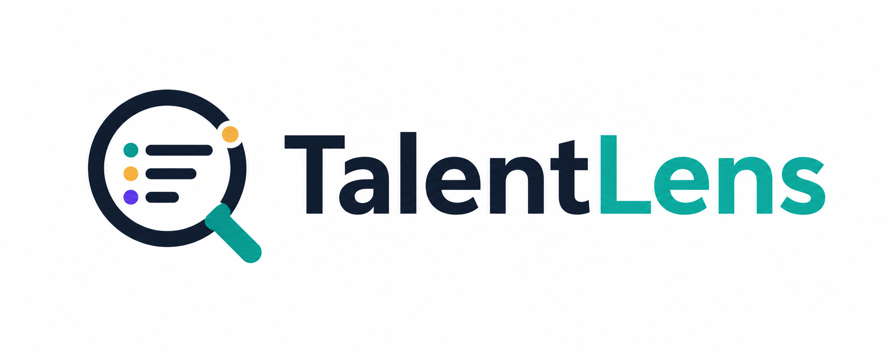

# TalentLens - Intelligent Candidate Discovery & Ranking

<p align="center">
  
</p>

> **Team:** The Monolith  
> **Member:** Mohana Krishna  
> **Challenge:** Redrob AI Hiring Challenge - INDIA RUNS

## What This Does

TalentLens ranks 100,000 candidate profiles against the released Senior AI Engineer job description and outputs the best 100 candidates in the required CSV format.

The JD is intentionally adversarial. A naive keyword matcher can over-rank profiles that list AI buzzwords without real production evidence. This ranker is designed to reward actual retrieval, ranking, ML systems, product-engineering, and availability signals instead of raw keyword count.

## Current Status

- Submission file: `codexmohan_6487.csv`
- Official validator: passing
- Latest full ranking run: `120.9s` on CPU, cold start, no network during ranking
- Latest gate result: `35,039` pass, `64,961` fail
- Gated honeypots in top 100: `0/100`
- Runtime constraint: under the 5-minute Stage 3 ranking limit

## Installation

Use Python 3.11 or 3.12. Do not use a global Python 3.13 install for local
development; the ML dependencies are pinned for the project environment.

This repo uses **Git LFS** for large precomputed artifacts. After cloning,
ensure LFS files are pulled:

```bash
git lfs install
git clone https://github.com/codex-mohan/TalentLens.git
cd TalentLens/indiaruns-ranker
```
### Recommended: uv

```bash
uv python install 3.11
uv sync --extra sandbox --extra dev
```

For optimized CPU embedding backends, also install the acceleration extra:

```bash
uv sync --extra sandbox --extra dev --extra cpu-accel
```

Run commands through `uv run` so they use `.venv`:

```bash
uv run python sandbox/app.py
```

### Standard venv + pip

```bash
python -m venv .venv
.venv\Scripts\activate
python -m pip install --upgrade pip
python -m pip install -r requirements.txt
```

After activation, normal `python ...` commands use the project venv.

`requirements.txt` includes the optional CPU acceleration stack. If you only
need the minimal ranker, install from `pyproject.toml` with `uv` instead.

## How It Works

The system is a two-phase hybrid ranker. `src.precompute` builds reusable local
artifacts; `src.rank` is the constrained no-network ranking step. `rank` now
loads the cached `features.jsonl` produced by `precompute`, so it no longer
re-extracts features from the candidate file.

### Optional Setup: Download Model Weights

Run this on a machine with network access before the no-network ranking step.
With `uv`:

```bash
uv run python scripts/download_models.py --artifacts ./artifacts
```

With an activated `.venv`, use the same command without `uv run`.

This stages the local Hugging Face models under `artifacts/models/`:

- `sentence-transformers/all-MiniLM-L6-v2` for candidate/JD embeddings.
- `cross-encoder/ms-marco-MiniLM-L-6-v2` for top-1,000 re-ranking.

### Phase 1: Precompute

Precompute is the first-time setup step. It may use network to download local
SentenceTransformer/CrossEncoder weights and is **not** bound by the 5-minute
ranking budget. On CPU, candidate embedding can take roughly **25-40 minutes**
for the full 100K dataset depending on backend, batch size, and CPU. On a local
GPU-capable global Python install it typically completes in roughly **2-3 minutes** for 100K candidates.
This is allowed by the competition spec: only the later `src.rank` step must
finish within the 5-minute CPU/no-network budget.

Default PyTorch CPU backend:

```bash
uv run python -m src.precompute \
  --candidates ../data/India_runs_data_and_ai_challenge/candidates.jsonl \
  --artifacts ./artifacts \
  --embed-batch-size 512 \
  --feature-workers 16
```

Fast CPU backend tested best on this machine: ONNX Runtime INT8 dynamic
quantization. First run exports the ONNX model; later runs reuse it from
`artifacts/models/`.

```bash
uv run --extra cpu-accel python -m src.precompute \
  --candidates ../data/India_runs_data_and_ai_challenge/candidates.jsonl \
  --artifacts ./artifacts \
  --embed-backend onnx-int8 \
  --onnx-quantization avx2 \
  --embed-batch-size 256 \
  --feature-workers 16
```

OpenVINO backends are also available for Intel CPU testing:

```bash
uv run --extra cpu-accel python -m src.precompute \
  --candidates ../data/India_runs_data_and_ai_challenge/candidates.jsonl \
  --artifacts ./artifacts \
  --embed-backend openvino \
  --embed-batch-size 256 \
  --feature-workers 16
```

With an activated `.venv`, remove `uv run` from the commands above.

Backend notes:

- `torch`: default, safest CPU path, but candidate embedding can be slow.
- `onnx-int8`: fastest backend measured on the sample run for candidate encoding (`1.9s` for 100 sample candidates vs `2.6s` for OpenVINO FP32). Uses dynamic INT8 quantization and no calibration dataset.
- `openvino`: Intel CPU backend without INT8 calibration.
- `openvino-int8`: static INT8 OpenVINO path. It can be fast on Intel CPUs but requires the `datasets` dependency because SentenceTransformers/Optimum uses a calibration dataset during export.

Local CUDA/global Python path, if your global `python` has CUDA Torch and you
want to build artifacts quickly. Do **not** use `uv` for this path if the `uv`
environment is CPU-only. Precompute on CUDA typically completes in roughly **2-3 minutes** for 100K candidates.

```bash
python -m src.precompute --candidates ..\data\India_runs_data_and_ai_challenge\candidates.jsonl --artifacts .\artifacts --embed-batch-size 512 --feature-workers 16
```

Then CPU-only rank:

```bash
python -m src.rank --candidates ..\data\India_runs_data_and_ai_challenge\candidates.jsonl --artifacts .\artifacts --out .\codexmohan_6487_global_cuda.csv
```

To confirm the global Python has CUDA before running precompute:

```bash
python -c "import torch; print(torch.__version__, torch.cuda.is_available(), torch.version.cuda)"
```

This step:

- Loads candidates with `orjson`.
- Extracts per-candidate features from profile, career, skills, education, and Redrob signals. Feature extraction can run in parallel via `--feature-workers`.
- Encodes candidate text with `sentence-transformers/all-MiniLM-L6-v2` using the selected backend: PyTorch, ONNX INT8, OpenVINO, or OpenVINO INT8.
- Builds a TF-IDF index over candidate text.
- Saves the JD embedding, candidate embeddings, ordered candidate IDs, TF-IDF artifacts, feature JSONL, JD text, and `manifest.json`.
- Writes `features.jsonl` and `manifest.json` with `orjson`.
- Saves model directories under `artifacts/models/` so ranking can run offline.

`manifest.json` records the candidate count, candidate-file hash, and ordered
candidate-ID hash. `rank.py` refuses to score if the current candidate file
does not match the precomputed artifacts.

Artifacts are trusted, self-generated cache files. If they are missing, stale,
or from an unknown source, regenerate them with `src.precompute`.

### Phase 2: Rank

Ranking is the constrained reproduction step: CPU only, no hosted APIs, no network required when artifacts are present. It requires the cross-encoder model directory produced by `scripts/download_models.py` or `src.precompute`; missing model/artifact files are fatal because fallback ranking would not reproduce the submitted CSV.

```bash
uv run python -m src.rank \
  --candidates ../data/India_runs_data_and_ai_challenge/candidates.jsonl \
  --artifacts ./artifacts \
  --out ./codexmohan_6487.csv
```

With an activated `.venv`, use `python -m src.rank ...`.

This step:

- Loads precomputed embeddings, TF-IDF, ordered IDs, JD text, manifest, and cached models.
- Validates artifact/candidate alignment before scoring, including the candidate file SHA256.
- Loads precomputed `features.jsonl` instead of re-extracting features at rank time.
- Applies honeypot and JD hard-disqualifier gates.
- Computes semantic, lexical, skill-evidence, career-fit, experience, location, and behavioral scores.
- Re-ranks the top 1,000 gate-passed candidates with the cached cross-encoder.
- Writes the top 100 candidates with deterministic, field-grounded reasoning.

### Validate

```bash
uv run python ../data/India_runs_data_and_ai_challenge/validate_submission.py ./codexmohan_6487.csv
```

## Scoring Formula

```text
gate        = 0 if honeypot OR hard disqualifier, else 1

raw_score   = 0.30 * semantic
            + 0.20 * lexical
            + 0.25 * skill_evidence
            + 0.15 * career_fit
            + 0.05 * yoe_band
            + 0.05 * location

final_score = gate * raw_score * behavioral_multiplier
```

The cross-encoder is used as a corrective semantic signal for the top 1,000 candidates:

```text
semantic = 0.45 * cross_encoder_normalized + 0.55 * bi_encoder_cosine
```

## Components

| Component | How it works | Why it matters |
|---|---|---|
| Semantic | MiniLM embedding cosine between JD and candidate text | Finds related experience even when exact wording differs |
| Lexical | TF-IDF cosine over career, skills, title, summary, and profile text | Preserves exact-match signals like FAISS, BM25, NDCG, Pinecone |
| Skill evidence | JD taxonomy matched through proficiency, duration, and endorsements | Suppresses keyword-stuffed skills with no usage evidence |
| Career fit | Title archetype plus eval, scale, education, certification, and company-context signals | Rewards applied ML/search/retrieval profiles over unrelated roles |
| Experience band | Gaussian around the JD's 5-9 year preference. YOE computed from career history dates, not self-reported field. Overreported YOE penalized proportional to sqrt of deviation. | Favors the senior IC sweet spot. Catches typos and fraud. |
| Location | Pune/Noida/Tier-1 India preference, relocation fallback | Matches the JD logistics |
| Behavioral | Recency, response rate, interview completion, offer acceptance, active applications, recruiter interest, GitHub, notice period, skill assessment average, salary reasonableness | Down-weights candidates who are strong on paper but unlikely to engage. No self-reported flags — only observed behavior |

## Honeypot And Gate Logic

Before scoring, the gate removes candidates that should not compete for top-100 slots.

Honeypot signatures currently checked:

- Impossible or unreasonable years of experience.
- Three or more `expert` skills with `0` months of usage.
- Eight or more skills with both `0` endorsements and `0` months of usage.
- Three or more advanced/expert claims with no endorsement and no duration evidence.

JD hard disqualifiers currently checked:

- Consulting-only career history (all companies are consulting firms).
- Current consulting role penalty: candidates currently at a consulting firm (TCS, Infosys, Wipro, Accenture, Cognizant, Capgemini, Genpact, etc.) receive a moderate career-fit penalty even if prior roles were at product companies. Per the JD: "currently at one of these companies but have prior product-company experience, that's fine" — these candidates are not disqualified, but ranked lower than equivalent product-company candidates.
- Research-heavy background without production-code evidence.
- Title-chaser pattern with very short average tenure.
- Tech-lead/architecture-only profile with no recent production-code signal.
- Closed-source-only services/consulting background without external validation.
- No relevant retrieval or ML-support skills.

## Reasoning

Each selected candidate gets a deterministic 1-2 sentence explanation built from actual candidate fields only. No LLM is called at rank time.

Reasoning tiers:

- Ranks 1-25: assertive, strength-led reasoning.
- Ranks 26-75: trade-off-aware reasoning with an honest concern when available.
- Ranks 76-100: cautious tail-end reasoning.

The generator references real fields such as title, years of experience, company, evidenced skill categories, career text signals, response rate, recency, location, and notice period.

## Project Structure

```text
indiaruns-ranker/
  src/
    config.py          - taxonomy, weights, thresholds
    io.py              - JSONL streaming reader
    features.py        - per-candidate feature extraction
    semantic.py        - MiniLM embedding helpers
    sparse.py          - TF-IDF helpers
    honeypot.py        - honeypot and hard-disqualifier gate
    scoring.py         - final score formula
    reasoning.py       - deterministic factual reasonings
    precompute.py      - offline artifact builder
    rank.py            - constrained ranking entry point
    rerank.py          - cross-encoder re-ranking helper
  data/
    sample/            - small sample for sandbox use
    job_description.md - local JD copy when available
  sandbox/
    app.py             - Gradio sandbox app
  tests/
    *.py               - validation and analysis helpers
  artifacts/           - generated/cached local ranking artifacts
  codexmohan_6487.csv  - current validated submission CSV
  submission_metadata.yaml
```

## Sandbox

Use the project environment from [Installation](#installation).

With `uv`:

```bash
uv sync --extra sandbox --extra dev
uv run python sandbox/app.py
```

With an activated `.venv`:

```bash
python sandbox/app.py
```

The sandbox is intentionally one-click: choose the bundled sample or upload a
small JSONL file, and it automatically precomputes matching local artifacts
before ranking. First run prepares embeddings/indexes; later runs reuse the
cache under `artifacts/sandbox/`.

### Hosted HuggingFace demo limits

The HuggingFace Space uses the same Gradio app as local development and is
configured to accept up to 100,000 candidates. However, HuggingFace free/runtime
environments may restrict upload duration, CPU time, memory, or long-lived
browser/WebSocket sessions. A full 100K upload may therefore time out or lose
connection even though the same pipeline works locally. The hosted path is best
for the bundled sample or smaller uploads; if the full pool times out in the
browser, use the CLI reproduction path below.

Full ranking is supported through the CLI path:

```bash
uv run python -m src.precompute --candidates <candidates.jsonl> --artifacts ./artifacts
uv run python -m src.rank --candidates <candidates.jsonl> --artifacts ./artifacts --out ./codexmohan_6487.csv
```

With an activated `.venv`, remove `uv run` from those commands.

Local Gradio uses the same `sandbox/app.py` as the hosted Space. For full
100K ranking, prefer the CLI commands above because they are not limited by a
browser/WebSocket session.

Docker option for the Gradio sandbox:

```bash
docker build -t talentlens .
docker run --rm -p 7860:7860 talentlens
```

Then open `http://localhost:7860`.

## Notes For Reviewers

- The hidden ground-truth metrics cannot be verified locally because the leaderboard labels are private.
- Local validation confirms format compliance, runtime readiness, deterministic reproduction, and no gated honeypots in the produced top 100.
- The latest measured runtime on this machine was `120.9s` (cold start, PyTorch only — TensorFlow removed), well under the 5-minute Stage 3 limit.

## Architecture Decisions

### YOE Computation: Career Dates Over Self-Reported Field

The `years_of_experience` field in candidate profiles is unreliable. We found candidates where the field says 2.9 years but career history shows 6.2 years, and the candidate's own summary says "6.3 years." Rather than trusting a single number field, we compute YOE from career history dates (earliest start → today).

**Logic:**
- If reported ≤ calculated: use calculated (handles typos, underreporting)
- If reported > calculated: penalize with `calculated * max(0.3, sqrt(calculated/reported))` (handles fraud)
- Fallback to reported if no career dates are parseable

This means a candidate who underreports (typo like 2.9 instead of 6.9) gets the correct YOE, while a candidate who overreports (claiming 15yr on a 6yr career) gets a proportional penalty.

### Behavioral Signals: Observed Behavior Over Self-Reported Flags

The JD explicitly says: "a perfect-on-paper candidate who hasn't logged in for 6 months and has a 5% recruiter response rate is, for hiring purposes, not actually available."

We removed the `open_to_work_flag` from scoring. It's a self-reported button click. Instead, we use observed signals:
- `recruiter_response_rate`: do they reply to recruiters?
- `last_active_date`: when did they last log in?
- `interview_completion_rate`: do they show up to interviews?
- `offer_acceptance_rate`: do they accept offers?
- `applications_submitted_30d`: are they actively applying?
- `saved_by_recruiters_30d`: are recruiters interested in them?
- `notice_period_days`: how soon can they start?

### Consulting Detection: Current Role Matters

The JD says: "People who have only worked at consulting firms... we've had bad fit experiences. If you're currently at one of these companies but have prior product-company experience, that's fine."

We implement this as a two-tier system:
- **Consulting-only** (all companies are consulting): career_fit × 0.1 (near-disqualification)
- **Current consulting** (current company is consulting, prior is product): career_fit × 0.55 (moderate penalty)

This catches candidates who spent 4 years at Genpact after LinkedIn — they're not disqualified per the JD, but ranked lower than equivalent product-company candidates.

### Location: Hard Penalty for Outside India

The JD says: "Outside India: case-by-case, but we don't sponsor work visas."

We implement this as:
- Tier-1 India (Pune, Noida, Delhi, Mumbai, etc.): 1.0
- Other India: 0.7
- Outside India, willing to relocate: 0.15
- Outside India, no relocation: 0.05

A candidate in New York with strong skills will score near-zero on location, which significantly reduces their final ranking.

### Honeypot Detection

The dataset contains ~80 impossible profiles. We detect:
- Impossible YOE (< 0 or > 45)
- 3+ expert skills with 0 months of usage
- 8+ skills with both 0 endorsements and 0 months
- 3+ advanced/expert claims with no endorsement and no duration

Candidates failing the gate receive score 0 and are excluded from top 100.

### Cross-Encoder Re-Ranking

The top 1,000 gate-passed candidates are re-ranked with `cross-encoder/ms-marco-MiniLM-L-6-v2`, which reads (JD, candidate career text) jointly. This catches false positives the bi-encoder misses — e.g., computer vision work scored as relevant because both share "model", "fine-tuned", "production" keywords.

Final semantic score: `0.45 × cross_encoder_normalized + 0.55 × bi_encoder_cosine`

### Grid Search (Preserved, Not Applied)

We ran a grid search over 10,517 weight combinations (step=0.05). The best proxy score was only 1.5% better than hand-tuned weights, and the top 10 changed significantly (6/10 different candidates). Without ground truth labels, we cannot verify the grid search improves NDCG@10. The weights are preserved on branch `feat/grid-search-weights` for future use.

## Team

| Field | Value |
|---|---|
| Team name | The Monolith |
| Member | Mohana Krishna |
| Location | Vellore, Tamil Nadu, India |
| Email | codexmohan@gmail.com |
| Phone | +91-6381131277 |
